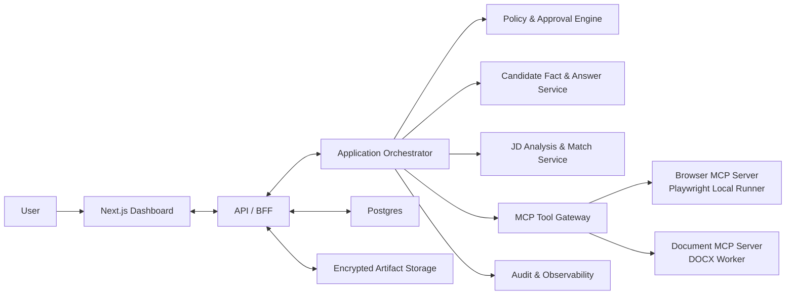

# Resume Agent

Resume Agent is a human-supervised workspace for tailoring resumes to job descriptions and completing job application forms across different websites.

The project combines a web dashboard, an agent orchestrator, Playwright browser automation, and MCP-based tool boundaries. Its goal is to give the agent enough flexibility to understand unfamiliar forms while keeping candidate facts, sensitive answers, and final submissions under explicit user control.

> **Status:** Architecture and Phase 0 planning. The first end-to-end implementation has not been released yet.

## Core capabilities

### Adaptive application form filling

- Inspect unfamiliar application pages and normalize their controls into a common field model.
- Map fields to verified candidate facts and reusable answers.
- Fill text inputs, selects, checkboxes, radio groups, repeated sections, and file uploads.
- Re-scan pages after navigation or dynamic DOM changes.
- Pause for login, MFA, CAPTCHA, ambiguous questions, or manual browser takeover.
- Require a final review and explicit approval before submission.

### JD-aware resume tailoring

- Parse must-have and preferred requirements from a job description.
- Match requirements to a verified candidate fact store.
- Produce evidence-backed resume changes without inventing experience.
- Show semantic and text diffs before applying changes.
- Preserve DOCX templates and run structural and visual quality checks before export.

### Dashboard control plane

- Manage candidate facts, jobs, resume versions, and application tasks.
- Review field mappings, answer sources, confidence, and risk.
- Pause, resume, cancel, or take over browser runs.
- Inspect redacted screenshots, traces, errors, approvals, and submission receipts.
- Configure MCP tools, data retention, secrets, and automation policy.

## Safety model

Resume Agent uses bounded autonomy:

- The agent may inspect pages, plan actions, map fields, and perform reversible form edits.
- A deterministic policy engine evaluates every tool call.
- Unsupported resume claims are blocked.
- Sensitive demographic, legal, signature, and background-check fields require user action.
- Passwords, cookies, MFA values, and provider keys are kept out of model context and normal logs.
- CAPTCHA and anti-bot mechanisms are never bypassed.
- Final submission always requires a fresh, application-specific approval.

The public [threat model](docs/THREAT_MODEL.md) records the trust boundaries, implemented contract controls, and runtime safeguards required before real candidate data is used.
The controlled [fixture-form specification](docs/FIXTURE_FORM_SPEC.md) defines the safe regression target for browser automation.

## High-level architecture



## Application workflow

1. Import a master resume and verify extracted candidate facts.
2. Add a job description and review its structured requirements.
3. Review and approve an evidence-backed tailored resume.
4. Start a local Playwright browser session from the dashboard.
5. Let the agent fill high-confidence, low-risk fields.
6. Resolve ambiguous or sensitive questions and take over when needed.
7. Review every final value and uploaded artifact.
8. Explicitly approve submission.
9. Save the confirmation, application ID, and redacted audit trail.

## Planned repository structure

```text
resume-agent/
├── apps/
│   ├── dashboard/             # Next.js UI and BFF
│   └── fixture-forms/         # Safe application-form test site
├── services/
│   ├── orchestrator/          # Agent workflow and durable state machine
│   ├── browser-runner/        # Playwright runner and Browser MCP server
│   └── document-worker/       # DOCX worker and Document MCP server
├── packages/
│   ├── contracts/             # Shared Zod and JSON Schema contracts
│   ├── domain/                # Facts, jobs, resumes, and applications
│   ├── policy/                # Risk and approval rules
│   └── observability/         # Events, traces, and redaction
├── prompts/                   # Versioned agent instructions
├── fixtures/                  # Test resumes, JDs, and expected mappings
├── tests/                     # Integration and end-to-end tests
└── infra/                     # Local and deployment infrastructure
```

Directories will be added as the first vertical slice needs them instead of being scaffolded all at once.

## Roadmap

The public [task board](TASK_BOARD.md) is the source of truth for current progress.

The planned delivery order is:

1. Shared contracts, state machines, MCP tool schemas, and safety policy.
2. A thin dashboard-to-resume-to-form vertical slice.
3. Resume Studio, fact provenance, DOCX rendering, and quality gates.
4. Adaptive browser filling, checkpoints, takeover, and recovery.
5. Selected ATS adapters and production hardening.

## MVP non-goals

- Unattended bulk applications.
- Universal support for every hiring website.
- CAPTCHA or anti-bot bypass.
- Automatic answers to protected or legally consequential questions.
- Team collaboration and complex role-based access control.
- Email, calendar, or CRM automation.

## Project principles

- Facts before prose.
- Plan before action.
- Typed tools instead of unrestricted execution.
- Human approval for consequential actions.
- Local-first authenticated browser sessions.
- Observable and recoverable workflows.
