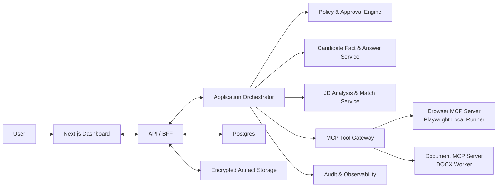

# Resume Agent

Resume Agent is a human-supervised workspace for tailoring resumes to job descriptions and completing job application forms across different websites.

The project combines a web dashboard, an agent orchestrator, Playwright browser automation, and MCP-based tool boundaries. Its goal is to give the agent enough flexibility to understand unfamiliar forms while keeping candidate facts, sensitive answers, and final submissions under explicit user control.

> **Status:** Phase 1 vertical slice in progress. Resume import, candidate-fact review, job-description parsing, and fact-backed resume tailoring run locally on your own machine; document rendering and the browser runner are not built yet.

## Core capabilities

### Adaptive application form filling

- Inspect unfamiliar application pages and normalize their controls into a common field model.
- Map fields to verified candidate facts and reusable answers.
- Fill text inputs, selects, checkboxes, radio groups, repeated sections, and file uploads.
- Re-scan pages after navigation or dynamic DOM changes.
- Pause for login, MFA, CAPTCHA, ambiguous questions, or manual browser takeover.
- Require a final review and explicit approval before submission.

### JD-aware resume tailoring

- Parse must-have and preferred requirements from a job description.
- Match requirements to a verified candidate fact store.
- Produce evidence-backed resume changes without inventing experience.
- Show semantic and text diffs before applying changes.
- Preserve DOCX templates and run structural and visual quality checks before export.

### Dashboard control plane

- Manage candidate facts, jobs, resume versions, and application tasks.
- Review field mappings, answer sources, confidence, and risk.
- Pause, resume, cancel, or take over browser runs.
- Inspect redacted screenshots, traces, errors, approvals, and submission receipts.
- Configure MCP tools, data retention, secrets, and automation policy.

## Safety model

Resume Agent uses bounded autonomy:

- The agent may inspect pages, plan actions, map fields, and perform reversible form edits.
- A deterministic policy engine evaluates every tool call.
- Unsupported resume claims are blocked.
- Sensitive demographic, legal, signature, and background-check fields require user action.
- Passwords, cookies, MFA values, and provider keys are kept out of model context and normal logs.
- CAPTCHA and anti-bot mechanisms are never bypassed.
- Final submission always requires a fresh, application-specific approval.

The public [threat model](docs/THREAT_MODEL.md) records the trust boundaries, implemented contract controls, and runtime safeguards required before real candidate data is used.
The controlled [fixture-form specification](docs/FIXTURE_FORM_SPEC.md) defines the safe regression target for browser automation.

## High-level architecture


```mermaid
flowchart LR
    USER["User"] --> UI["Next.js Dashboard"]
    UI <--> API["API / BFF"]
    API <--> ORCH["Application Orchestrator"]
    ORCH --> POLICY["Policy & Approval Engine"]
    ORCH --> PROFILE["Candidate Fact & Answer Service"]
    ORCH --> JD["JD Analysis & Match Service"]
    ORCH --> MCP["MCP Tool Gateway"]
    MCP --> BROWSER["Browser MCP Server<br/>Playwright Local Runner"]
    MCP --> DOCS["Document MCP Server<br/>DOCX Worker"]
    ORCH --> AUDIT["Audit & Observability"]
    API <--> DB["Postgres"]
    API <--> STORE["Encrypted Artifact Storage"]
```

## Application workflow

1. Import a master resume and verify extracted candidate facts.
2. Add a job description and review its structured requirements.
3. Review and approve an evidence-backed tailored resume.
4. Start a local Playwright browser session from the dashboard.
5. Let the agent fill high-confidence, low-risk fields.
6. Resolve ambiguous or sensitive questions and take over when needed.
7. Review every final value and uploaded artifact.
8. Explicitly approve submission.
9. Save the confirmation, application ID, and redacted audit trail.

## Planned repository structure

```text
resume-agent/
├── apps/
│   ├── dashboard/             # Next.js UI and BFF
│   └── fixture-forms/         # Safe application-form test site
├── services/
│   ├── orchestrator/          # Agent workflow and durable state machine
│   ├── browser-runner/        # Playwright runner and Browser MCP server
│   └── document-worker/       # DOCX worker and Document MCP server
├── packages/
│   ├── contracts/             # Shared Zod and JSON Schema contracts
│   ├── domain/                # Application and resume state machines
│   ├── resume-import/         # Deterministic resume-to-fact extraction and review
│   ├── jd-analysis/           # Deterministic JD-to-requirement parsing and review
│   ├── resume-tailor/         # Fact-backed change sets and the claim guard
│   ├── policy/                # Risk and approval rules
│   └── observability/         # Events, traces, and redaction
├── prompts/                   # Versioned agent instructions
├── fixtures/                  # Test resumes, JDs, and expected mappings
├── tests/                     # Integration and end-to-end tests
└── infra/                     # Local and deployment infrastructure
```

Directories will be added as the first vertical slice needs them instead of being scaffolded all at once.

## Local dashboard

The dashboard provides an overview, an application workspace, the profile vault, job intake, and Resume Studio. The overview and application workspace still use clearly labeled local demonstration data. The profile vault, job intake, and Resume Studio are real: they import your master resume, the job descriptions you paste, and the tailored change sets built from them.

Install the workspace dependencies, then start it with:

```bash
npm run dev:dashboard
```

Open `http://localhost:3000` for the control plane, `http://localhost:3000/profile` for the profile vault, `http://localhost:3000/jobs` for job intake, `http://localhost:3000/resume` for Resume Studio, or `http://localhost:3000/applications` for the application workspace.

### Importing a master resume

The profile vault accepts a `.docx`, `.txt`, or `.md` resume. The file is parsed on your machine, and a deterministic extractor turns it into candidate facts. It copies text; it never rewrites or completes it, and every fact cites the line it came from.

Every extracted fact starts as **pending**. Pending facts are inert: resume tailoring and form filling draw only on facts you have verified. You verify or reject each one in the review list, and a rejection records your reason. Lines that look like a credential are dropped before anything is stored, and the import report shows which sections were read and which lines were skipped.

### Adding a job description

Job intake takes a pasted posting. You supply the role title and company, because the parser copies what the posting says and never infers facts about it. A deterministic parser then splits the posting into requirements, marking each as **must have**, **preferred**, or **context** based on the section it was written under, and citing the line it came from.

A posting is untrusted input. Lines that address the agent — for example text trying to override its instructions — are dropped before anything is stored, and their wording never reaches a stored requirement or the parse report. Benefits, company blurbs, and legal notices are left out, and the parse report shows every section that was read and every line that was skipped.

You can correct any requirement's priority or kind, or dismiss a line that is not a requirement. Re-parsing an updated posting keeps your corrections for requirements it still contains.

### Tailoring a resume

Resume Studio builds a resume from your **verified** facts and tailors it to one job. A pending or rejected fact is invisible to this step, so nothing you have not confirmed can appear in a resume.

Phase 1 tailoring **selects; it does not write.** Each line is kept when a verified fact behind it supports a requirement of the posting, and removed otherwise — so every proposed change cites both the facts it rests on and the requirements it answers, and you read why each line survived instead of trusting a score. You approve or reject each change, and rejecting a removal is how you keep a line the generator wanted to drop.

Requirement coverage is reported honestly: a requirement with no verified fact behind it is shown as **no fact**, and nothing is written to claim it.

Before any change set reaches that review screen it must pass the **claim guard**, which rejects a change that cites an unverified fact, cites a requirement from another job, misreports the wording it replaces, or — once generated prose is introduced in a later phase — states terms or figures absent from the facts it cites. A change set that fails is kept with its violations and is not approvable. Today the generator writes no prose at all, so the guard is in place before there is anything for it to catch.

### Local data

Imported facts, source resumes, pasted job descriptions, and parsed requirements are stored unencrypted in a local, Git-ignored `.data` directory next to the dashboard, or in `RESUME_AGENT_DATA_DIR` when it is set. **Delete local data** in the profile vault and in job intake removes each of them. Encrypted storage, retention windows, and access control are Phase 5 release gates, so treat this directory as ordinary personal data on your device.

## Roadmap

The public [task board](TASK_BOARD.md) is the source of truth for current progress.

The planned delivery order is:

1. Shared contracts, state machines, MCP tool schemas, and safety policy.
2. A thin dashboard-to-resume-to-form vertical slice.
3. Resume Studio, fact provenance, DOCX rendering, and quality gates.
4. Adaptive browser filling, checkpoints, takeover, and recovery.
5. Selected ATS adapters and production hardening.

## MVP non-goals

- Unattended bulk applications.
- Universal support for every hiring website.
- CAPTCHA or anti-bot bypass.
- Automatic answers to protected or legally consequential questions.
- Team collaboration and complex role-based access control.
- Email, calendar, or CRM automation.

## Project principles

- Facts before prose.
- Plan before action.
- Typed tools instead of unrestricted execution.
- Human approval for consequential actions.
- Local-first authenticated browser sessions.
- Observable and recoverable workflows.
