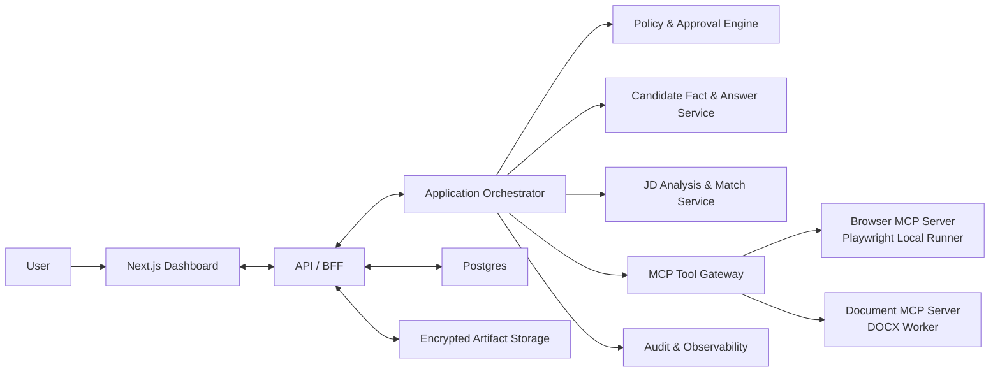

# Resume Agent

Resume Agent is a human-supervised workspace for tailoring resumes to job descriptions and completing job application forms across different websites.

The project combines a web dashboard, an agent orchestrator, Playwright browser automation, and MCP-based tool boundaries. Its goal is to give the agent enough flexibility to understand unfamiliar forms while keeping candidate facts, sensitive answers, and final submissions under explicit user control.

> **Status:** Phase 1 vertical slice in progress. Resume import, candidate-fact review, job-description parsing, fact-backed tailoring, DOCX generation, and a local browser runner that observes and fills basic fields all work on your own machine. The runner points only at the local fixture lab, and it has no submit tool at all, so nothing is submitted anywhere.

## Core capabilities

### Adaptive application form filling

- Inspect unfamiliar application pages and normalize their controls into a common field model.
- Map fields to verified candidate facts and reusable answers.
- Fill text inputs, selects, checkboxes, radio groups, repeated sections, and file uploads.
- Re-scan pages after navigation or dynamic DOM changes.
- Pause for login, MFA, CAPTCHA, ambiguous questions, or manual browser takeover.
- Require a final review and explicit approval before submission.

### JD-aware resume tailoring

- Parse must-have and preferred requirements from a job description.
- Match requirements to a verified candidate fact store.
- Produce evidence-backed resume changes without inventing experience.
- Show semantic and text diffs before applying changes.
- Preserve DOCX templates and run structural and visual quality checks before export.

### Dashboard control plane

- Manage candidate facts, jobs, resume versions, and application tasks.
- Review field mappings, answer sources, confidence, and risk.
- Pause, resume, cancel, or take over browser runs.
- Inspect redacted screenshots, traces, errors, approvals, and submission receipts.
- Configure MCP tools, data retention, secrets, and automation policy.

## Safety model

Resume Agent uses bounded autonomy:

- The agent may inspect pages, plan actions, map fields, and perform reversible form edits.
- A deterministic policy engine evaluates every tool call.
- Unsupported resume claims are blocked.
- Sensitive demographic, legal, signature, and background-check fields require user action.
- Passwords, cookies, MFA values, and provider keys are kept out of model context and normal logs.
- CAPTCHA and anti-bot mechanisms are never bypassed.
- Final submission always requires a fresh, application-specific approval.

The public [threat model](docs/THREAT_MODEL.md) records the trust boundaries, implemented contract controls, and runtime safeguards required before real candidate data is used.
The controlled [fixture-form specification](docs/FIXTURE_FORM_SPEC.md) defines the safe regression target for browser automation.

## High-level architecture


```mermaid
flowchart LR
    USER["User"] --> UI["Next.js Dashboard"]
    UI <--> API["API / BFF"]
    API <--> ORCH["Application Orchestrator"]
    ORCH --> POLICY["Policy & Approval Engine"]
    ORCH --> PROFILE["Candidate Fact & Answer Service"]
    ORCH --> JD["JD Analysis & Match Service"]
    ORCH --> MCP["MCP Tool Gateway"]
    MCP --> BROWSER["Browser MCP Server<br/>Playwright Local Runner"]
    MCP --> DOCS["Document MCP Server<br/>DOCX Worker"]
    ORCH --> AUDIT["Audit & Observability"]
    API <--> DB["Postgres"]
    API <--> STORE["Encrypted Artifact Storage"]
```

## Application workflow

1. Import a master resume and verify extracted candidate facts.
2. Add a job description and review its structured requirements.
3. Review and approve an evidence-backed tailored resume.
4. Start a local Playwright browser session from the dashboard.
5. Let the agent fill high-confidence, low-risk fields.
6. Resolve ambiguous or sensitive questions and take over when needed.
7. Review every final value and uploaded artifact.
8. Explicitly approve submission.
9. Save the confirmation, application ID, and redacted audit trail.

## Planned repository structure

```text
resume-agent/
├── apps/
│   ├── dashboard/             # Next.js UI and BFF
│   └── fixture-forms/         # Safe application-form test site
├── services/
│   ├── orchestrator/          # Agent workflow and durable state machine
│   ├── browser-runner/        # Playwright runner and Browser MCP server
│   └── document-worker/       # DOCX worker and Document MCP server
├── packages/
│   ├── contracts/             # Shared Zod and JSON Schema contracts
│   ├── domain/                # Application and resume state machines
│   ├── resume-import/         # Deterministic resume-to-fact extraction and review
│   ├── jd-analysis/           # Deterministic JD-to-requirement parsing and review
│   ├── resume-tailor/         # Fact-backed change sets and the claim guard
│   ├── document-build/        # DOCX generation and post-build verification
│   ├── policy/                # Risk and approval rules
│   └── observability/         # Events, traces, and redaction
├── prompts/                   # Versioned agent instructions
├── fixtures/                  # Test resumes, JDs, and expected mappings
├── tests/                     # Integration and end-to-end tests
└── infra/                     # Local and deployment infrastructure
```

Directories will be added as the first vertical slice needs them instead of being scaffolded all at once.

## Local dashboard

### Job Agent

Open `/agent` for the job discovery and preparation workspace. Configure roles and locations (defaults: GTA, Ottawa and Kingston), edit the starter Greenhouse/Lever company boards, and select **Save & find jobs**. Public collection requires no model key. The inbox records saves, dismissals and approvals, keeps repeated scans deduplicated, and reports source failures separately from closed postings. Scores currently describe role/location preferences, not qualifications or interview probability.

**Assess fit with AI** uses Gemini to compare parsed requirements with verified, non-conflicted facts. It reports cited support, partial support and gaps separately from the preference score. Saved assessments become stale when their profile facts or posting change. This action requires the server-side key; no personal contact facts are sent to the matching model.

**Search web jobs** is the general, cross-site search entry on `/agent`. It does not restrict results to Greenhouse/Lever: public indexed LinkedIn, Indeed, company careers and other ATS links can appear. Edit the role/location query (default GTA/Toronto, Ottawa and Kingston); optionally add `site:linkedin.com/jobs/view` or `site:indeed.com`. Board preference filters do not apply to these separate web queries. Configure `BRAVE_SEARCH_API_KEY` on the server and confirm storage rights with `BRAVE_SEARCH_STORAGE_ALLOWED=true`, then restart. Gemini alone does not enable this search.

Each click makes one bounded search request, at most 20 results, without automatic retries or fetching destination pages. Results display source, title, summary and last-seen time, **not verified posting dates, open status or qualification scores**. Save/dismiss/reset leads; saved and dismissed URLs survive subsequent searches, while older undecided leads are replaced. The 200-lead limit fails visibly instead of discarding saved decisions. URL normalization removes known tracking and deduplicates identical URLs, not the same vacancy across different websites. Search data remains unencrypted local data and is excluded from Git.

To continue from a web lead, verify the employer/current vacancy and paste the complete JD into **Job intake**. Search summaries are not sufficient evidence for resume preparation. This increment does not log into LinkedIn, scrape protected pages, upload resumes or submit applications. Tests use synthetic provider responses; real Brave-key coverage/quality acceptance is still pending. Run `npm run test --workspace @resume-agent/dashboard -- test/web-job-search.test.ts test/job-source-search.test.ts` for the search regression suite.

**Discover sources** searches for new Greenhouse/Lever company boards using optional Brave Web Search. Configure server-side `BRAVE_SEARCH_API_KEY` and set `BRAVE_SEARCH_STORAGE_ALLOWED=true` only after confirming your plan explicitly permits storing results ([Brave guidance](https://brave.com/search/api/)). Restart the dashboard after configuration. One click sends one search request and checks at most six new feeds. Review each verified source and its company label, click **Add verified source**, then **Save & find jobs** to collect its jobs. No source is enrolled automatically. Search can incur separate provider charges; it does not require Gemini, and public collection of already configured boards still needs neither key. API-key acceptance has not yet been run against Brave.

**Optional posting filters** add maximum required experience, desired annual CAD salary and work-mode preferences. They default to unset and preserve existing recommendations. **Save preferences** re-filters existing jobs without an external request. Unknown conditions can be retained for review or excluded; they are never marked as matches. Open **Posting filter evidence** for the recognized statements and JD line citations. Extraction is deliberately narrow English pattern matching, not Gemini assessment: degree/experience alternatives, ambiguous currency, hourly compensation and unrecognized wording stay unknown. A salary range overlapping your minimum is not a guaranteed offer; remote-country/work-authorization eligibility still needs review. The displayed numerical score remains role/location fit only.

**Approve & prepare** records your choice against the exact posting, imports its JD, and calls the existing Gemini resume optimizer. A configured server-side key and verified profile facts are required for that step. Failures remain visible and retryable; successful proposals link to the correct change set in Resume Studio for review and the existing document workflow. Posting changes invalidate old authorization. Collection runs on demand; real-site uploads/submission and scheduled discovery remain subsequent increments. See [Job Agent design](docs/JOB_AGENT_DESIGN.md) for the full delivery sequence and authorization model.

**Application preparation checklist** opens a real task-specific page from each prepared/queued job card. It checks the posting approval, imported JD/change-set linkage, sentence decisions, current local claim guards, exact content approval, and DOCX manifest/render evidence/file bytes. Follow **Review this exact resume** to finish review, approval and document build in Resume Studio; a download link appears only when all these local checks pass. **Refresh checks** reads local state without an API key or external search. It does not confirm live posting availability or authorize form filling/submission. Missing tasks show a not-found page; the checklist never falls back to a different globally active resume. Test with `npm run test --workspace @resume-agent/dashboard -- test/application-readiness.test.ts`.

**Inspect public form**, inside that checklist, reads the approved Greenhouse posting's public question schema. It shows required question groups, instructions, field types, alternative inputs, unselected options and consent/disclosure notices. It sends no profile or answers, opens no browser form and needs no API key. Other ATS providers remain unsupported. The preview clears on refresh and is not a saved fill plan: dynamic/conditional questions and hosted-page controls still require browser observation. Live posting drift or revoked approval refuses inspection. Offline tests: `npm run test --workspace @resume-agent/dashboard -- test/ats-form-inspection.test.ts`. Set `RESUME_AGENT_LIVE_ATS=1` to opt into its public-GET-only smoke test. [Greenhouse's official API reference](https://docs.greenhouse.io/job-board.html#retrieve-a-job) describes the question endpoint; its submission endpoint is not used.

**Gemini answer drafts**, below the inspected form, prepares ordinary English narrative answers from verified, non-conflicted, non-sensitive employment/project/skill/education facts. Configure the server-side `GEMINI_API_KEY`, restart, inspect a current approved Greenhouse posting and click **Draft answers with Gemini**. Review the cited facts and approve or reject each wording; identity/contact, eligibility, compensation, consent, attachments, options and unsupported questions remain manual. The existing local grounded-wording guard is conservative, not a complete semantic guarantee. Generation makes one model call and two public form reads; each review rechecks the public form without a model call. Changed facts, posting approval, form or draft content invalidate old reviews. No form field is filled or submitted. Without a key generation is disabled; saved drafts remain reviewable.

Drafts and decisions are stored in unencrypted local `ats-answer-plans.json` under the existing data directory, for a single local dashboard process. **Replace with new Gemini drafts** replaces this task's previous plan and review history; a failed generation preserves it. **Delete saved drafts** deletes that plan only, not source profile facts. Do not expose this local dashboard as a multi-user service. Offline tests: `npm run test --workspace @resume-agent/dashboard -- test/ats-answer-plan.test.ts`. Real-key generation acceptance remains outstanding; injected model tests and labeled browser response fixtures are not live Gemini evidence.

**Observe hosted page (read only)** opens a temporary isolated Chromium browser for the exact approved canonical `job-boards.greenhouse.io/{board}/jobs/{id}` page. It compares DOM names/IDs, labels, control types and required flags with the public inventory. Missing, ambiguous, hidden, disabled, custom or differently grouped controls remain explicit review items. Login/MFA, access-check/CAPTCHA indicators, frames and network restrictions are reported, never bypassed. It requires local Playwright Chromium, but no API key or logged-in browser profile. Only the exact page and fixed Greenhouse presentation assets are fetched; non-GET requests, redirects, third-party services, frames and WebSockets are blocked. This can produce a partial page, not proof of a complete application. Two fresh public-form checks surround the read. The browser closes afterward; no values, screenshots or persistent browser session are returned, and no fill/upload/submit capability is created. The preview clears on refresh or a new failed read. Custom/legacy career URLs are not supported yet.

Upload diagnostics distinguish an individual **Attach** label from its explicitly named **Resume/CV** or **Cover Letter** group. Clipped/transparent controls are marked hidden, not visible; group naming alone never permits hidden-file writes. The preview explains unsupported file filters/modes, ambiguous group ownership and text alternatives referenced by a label but not mounted in the DOM. It does not click to activate them or read pasted resume text. File filters and group structure are included in freshness checks.

Presentation resources include only versioned English `job_post` and `common` translation dictionaries on the fixed Greenhouse CDN, fetched as GET JSON objects with a 128 KB limit. These resources can be required before the page attaches its interaction handlers. Pending or failed dictionary loads produce `presentation_assets_incomplete`, which blocks automatic actions; loading them is not proof of readiness. reCAPTCHA/hCaptcha script dependencies are reported as access-check signals even when their scripts are blocked and no visible challenge has appeared. Those pages require manual inspection; the agent does not enable, solve or bypass the check. Third-party services and employer write requests remain blocked, and presentation responses completing after the network lock are discarded.

For the supported grouped schema, expand **Inspect an unmounted resume-text alternative (offline)** and grant separate consent to **Inspect resume text switch (offline)**. This diagnostic starts a fresh browser, disables networking, validates and clicks only that group's native Enter manually button once, checks for an empty native textarea, then closes. It supplies no text or files. Unknown widgets, changed approval/schema or a control that fails to appear stop with no retry. The result is explicitly diagnostic-only and cannot approve a fill/upload plan. This does not reconnect or modify an existing supervised session; real-site compatibility remains unverified when the offline switch cannot reveal its control.

Run `npm run test --workspace @resume-agent/browser-runner -- test/greenhouse-observer.test.ts` for offline Chromium extraction/network-boundary tests and `npm run test --workspace @resume-agent/dashboard -- test/ats-dom-observation.test.ts` for task/schema/reconciliation tests. Set `RESUME_AGENT_LIVE_DOM=1` only to opt into the public-site/browser smoke test; its approval records use an isolated temporary store, never your actual job decisions.

**Build plan from approved answers** creates a five-minute **Reviewed-answer plan preview**. First approve at least one narrative answer above, then build the plan. The server fetches fresh hosted-page evidence and pairs only exact approved wording with unique visible, enabled ordinary text controls. Pending/rejected/manual answers, custom/select/file/hidden controls and unobserved questions stay manual; no missing value is guessed. The preview lists extra controls and observation limits. Access checks, unobserved frames, changing DOM and unknown safety signals block preview approval. A partial-network warning does not imply the whole form is complete.

**Approve preview only** reopens the read-only browser and requires unchanged DOM evidence, answer version, answer-review history, facts and posting approval. This records review, not authorization to fill. Both building and approving use two public-form checks and one ephemeral browser read, with no Gemini request and no answer values passed into the browser. Five-minute expiry or changed evidence requires rebuilding; a concurrent rejection cannot be overwritten by a slower approval. **Reject preview** and **Delete saved preview** work locally, including for an expired preview. Rebuilding replaces this task's previous preview/review history; a failed rebuild preserves it. Draft answers and profile facts are not removed when a preview is deleted.

**Supervised offline text filling (desktop pilot)** adds a separate execution step below the approved preview. Click **Open supervised browser (no typing)**, inspect the visible Chromium window, then tick the explicit consent checkbox and choose **Authorize and fill once (offline)**. Only exact approved ordinary narrative text is eligible; identity, eligibility, options, consent and file uploads remain manual/unsupported. Before any answer enters the page, its network is locked and the context goes offline. The agent never reconnects it. This is an offline inspection pilot, **not employer delivery or an application submission**; closing the window discards its form contents.

The opening step checks the public schema before and after launch; authorization checks it again. Each field rechecks current local facts, answer/preview reviews, expiry and DOM evidence, invokes the existing field policy, consumes a single-use reservation, refuses nonempty/readonly/short fields, then verifies the resulting value by hash. Errors stop remaining fields without retry or rollback. Authorization is persisted as consumed before writes, so duplicate requests and server restarts cannot replay it. Metadata-only receipts live in `ats-executions.json`; a receipt proves local read-back, not employer acceptance. Use **Stop and close supervised browser** even during filling; a field already in progress may be partially changed. Browser sessions expire within ten minutes; authorization is also limited by the original five-minute preview. This requires one local dashboard process and local Playwright Chromium, not an API key. Gemini generation still needs its key; real-key and real-employer write acceptance have not been performed.

Offline checks: `npm run test --workspace @resume-agent/dashboard -- test/ats-execution.test.ts` and `npm run test --workspace @resume-agent/browser-runner -- test/greenhouse-fill.test.ts test/greenhouse-observer.test.ts`. These use simulated providers and offline HTML, not user applications. No mobile or P6 rendering changes are included.

**Verified resume attachment (offline only)** is available after a successful supervised text fill while its reviewed plan is still fresh. Choose **Check verified DOCX for attachment**. The server reuses the existing task-specific posting/JD linkage, sentence decisions, current facts/claim guards, exact content approval, manifest, package and render-evidence checks. Only that task's current verified DOCX (up to 5 MB) is eligible — not an arbitrary local path or the globally active resume. Review the displayed build, byte size and SHA-256; use **Download this DOCX for review**, then explicitly confirm **Attach verified DOCX once (offline)**.

This supports one visible, uniquely corresponding Resume/CV native file input, either standalone or in the documented `resume` + `resume_text` alternative group. For a group, both native controls must be uniquely observed with matching labels and no shared question identifiers; the text alternative may be hidden but must exist and be completely empty. A narrow hidden-input adapter additionally supports one visible native **Attach** label uniquely associated with `resume` inside the same explicitly named Resume/CV group as the mounted `resume_text` control. The UI identifies this exact hidden-input association before separate consent; no button is clicked and no style is changed. Group naming by itself is insufficient. Text is checked before and after file selection without returning its value, and is never cleared or overwritten. A missing/changed/unlisted alternative or existing text stops the operation; grouped required status is not incorrectly treated as independently requiring both inputs. Other hidden inputs, multiple-file/directory inputs, other groups, cover letters, identity documents and arbitrary custom buttons remain unsupported. Occupied file inputs and fields that reject DOCX are refused. The upload policy still requires separate artifact confirmation; a consumed attempt cannot repeat, even on failure. The exact validated in-memory buffer is attached with the safe name `resume.docx`, then file name/type/size and SHA-256 are read back. Local document/fact/review changes invalidate the prepared scope. The browser stays offline: **attachment selection is not a completed upload or employer receipt**. There is no network reconnect, upload delivery or final submission. Real-employer acceptance remains pending.

Previews (including approved answer text) live in unencrypted local `ats-fill-plans.json`; delete them separately if no longer wanted. Reloading reads local history, not a live DOM. Test with `npm run test --workspace @resume-agent/dashboard -- test/ats-fill-plan.test.ts`. Tests inject browser observations/model output; real-key/end-to-end application filling remains unverified. Desktop acceptance is prioritized; no mobile work is included in this increment.

The dashboard provides an overview, an application workspace, the profile vault, job intake, and Resume Studio. The overview and application workspace still use clearly labeled local demonstration data. The profile vault, job intake, and Resume Studio are real: they import your master resume, the job descriptions you paste, and the tailored change sets built from them.

Install the workspace dependencies, then start it with:

```bash
npm run dev:dashboard
```

The core local workflow does not require a model API key. Fact extraction, JD parsing, deterministic matching and tailoring, document gates, and both claim guards remain local code; human review supplies the judgments that the program must not infer. Resume Studio and the runner also offer **optional** Gemini-assisted optimization. They require a server-side `GEMINI_API_KEY` only when used; without a key the AI buttons stay unavailable and there is no fake or silent fallback. `GEMINI_MODEL` may override the default stable `gemini-3.6-flash` model.

Open `http://localhost:3000` for the control plane, `http://localhost:3000/profile` for the profile vault, `http://localhost:3000/jobs` for job intake, `http://localhost:3000/resume` for Resume Studio, `http://localhost:3000/runner` for the browser runner, or `http://localhost:3000/applications` for the application workspace.

### Importing a master resume

The profile vault accepts a `.docx`, `.txt`, or `.md` resume. The file is parsed on your machine, and a deterministic extractor turns it into candidate facts. It copies text; it never rewrites or completes it, and every fact cites the line it came from.

Every extracted fact starts as **pending**. Pending facts are inert: resume tailoring and form filling draw only on facts you have verified. You verify or reject each one in the review list, and a rejection records your reason. Lines that look like a credential are dropped before anything is stored, and the import report shows which sections were read and which lines were skipped.

When two imports assert different values for the same fact, the profile vault groups the competing values with every source file, locator, and excerpt. The whole group is inert—even if an older value was verified—until you review the combined evidence and choose one value. That decision is bound to the exact evidence snapshot; changed or newly imported evidence must be reviewed again.

### Adding a job description

Job intake takes a pasted posting. You supply the role title and company, because the parser copies what the posting says and never infers facts about it. A deterministic parser then splits the posting into requirements, marking each as **must have**, **preferred**, or **context** based on the section it was written under, and citing the line it came from.

A posting is untrusted input. Lines that address the agent — for example text trying to override its instructions — are dropped before anything is stored, and their wording never reaches a stored requirement or the parse report. Benefits, company blurbs, and legal notices are left out, and the parse report shows every section that was read and every line that was skipped.

You can correct any requirement's priority or kind, or dismiss a line that is not a requirement. Re-parsing an updated posting keeps your corrections for requirements it still contains.

### Tailoring a resume

Resume Studio builds a resume from your **verified, conflict-free** facts and tailors it to one job. A pending, rejected, or disputed fact is invisible to this step, so nothing you have not confirmed can appear in a resume.

Phase 1 tailoring **selects; it does not write.** Each line is kept when a verified fact behind it supports a requirement of the posting, and removed otherwise — so every proposed change cites both the facts it rests on and the requirements it answers. Review is sentence-level: every proposed or removed sentence has its own stable ID and evidence-bound hash, and you choose the proposal or original wording independently. Existing whole-change decisions remain readable for backward compatibility.

Requirement coverage is reported as a JD-to-fact evidence matrix. Each row shows the exact job-description citation, the candidate facts and resume citations behind the match, the wording that matched, and deterministic confidence. A requirement with no verified fact is shown as **no fact**; a match that rests only on disputed facts is shown as **disputed** and cannot support resume content.

**AI optimize resume** adds an optional Gemini semantic pass. It can recognize credible relevance without literal keyword overlap and can propose clearer wording, but it receives only verified normal-sensitivity facts; contact and other PII values are withheld. Model output is a closed, ID-only plan that local code binds back to the exact fact, requirement, and resume snapshots. A rewrite is rejected before storage if it introduces a word, number, direction, responsibility level, or proficiency absent from the item's own facts. Accepted proposals still enter the same sentence-by-sentence review and cannot be approved until both deterministic and semantic claim guards pass.

Before any change set reaches review it must pass two independent **claim guards**. The deterministic layer validates exact fact and requirement snapshots, citations, wording lineage, terms, and figures. The semantic layer reports meaning-changing contradictions in polarity, outcome direction, responsibility, and proficiency. Approval recomputes both over the exact sentence choices the reviewer finalized, and each report is bound to that content hash; document building repeats the checks against current evidence. A missing, stale, or failing layer blocks the transition with actionable violations and no silent fallback.

### Building the document

Once every change is decided, you approve the content. Approval freezes exactly what you reviewed, and the builder reads that approval alone — so a finished document can always be traced back to content a person approved.

The DOCX applies approved content to one immutable, ATS-safe single-column template with explicit Arial typography, real Word paragraph styles and bullet numbering, section hierarchy, spacing, and Letter page geometry. Approval binds both content and this presentation; the build records the template ID, version, and fingerprint. Immediately after writing, the file is **read back off disk** and checked against the approval, template parts, byte hash, change set, block facts, and both directions of the text.

Delivery adds five fail-closed gates over the exact bytes: ZIP/package safety, metadata and privacy residue, ATS-safe OOXML structure, complete page rendering, and a visual baseline plus defect inspection for every page. Trusted render evidence is bound to the build, output hash, template hash, page image hashes, dimensions, and comparison hash; it is revalidated at download time. Old reports and builds with missing, malformed, stale, or replayed evidence are kept for diagnosis but cannot enter `docx_built` or be downloaded.

On Windows, install LibreOffice and ensure Poppler's `pdftoppm`, `pdftotext`, and `pdffonts` are available. The build route automatically renders the exact DOCX locally and creates the trusted evidence; no API key or browser-supplied assertion is involved. Non-standard executable locations can be set with `RESUME_AGENT_LIBREOFFICE_PATH`, `RESUME_AGENT_PDFTOPPM_PATH`, `RESUME_AGENT_PDFTOTEXT_PATH`, and `RESUME_AGENT_PDFFONTS_PATH`.

Each downloadable DOCX also has a reproducible JSON manifest binding its exact bytes to the immutable resume version, approval, change set, fact and requirement snapshots, template and builder versions, and every QA evidence hash. Both downloads revalidate this lineage. Resume Studio keeps approved version snapshots immutable; restoring one only changes the active pointer and appends a hash-bound restore record, so it never overwrites the current or historical content.

The resume state machine gates the path independently. It refuses to fact-check a version unless every line is fact-backed, every cited fact is still verified, and both content-hash-bound claim reports passed; it refuses `docx_built` unless the guards are current and the written document verified against its inputs. Regenerating a change set clears the approval and document that rested on it, because those decisions were made about different wording.

### Running the browser

The runner page starts a local Playwright browser, observes a page, and stops it. It points only at the local [fixture form lab](apps/fixture-forms/README.md), never a real hiring site, and the target and origin allowlist come from local configuration rather than from the request.

Start the lab in a second terminal:

```bash
npm run dev:fixtures
```

Every tool call is evaluated by the policy engine before the browser is touched, and the runner page lists each call with the route and reasons it was given. A snapshot carries structure — roles, accessible names, requiredness, sensitivity — and **never a field value**: the observation script returns whether a control holds a value and a digest of it, not the value, so an answer never leaves the page.

### Filling fields

**Plan fill** shows what the runner would type, field by field, without touching anything. **Fill allowed fields** then writes only what the policy engine allows.

**AI plan** and **AI optimize & fill** add an optional Gemini planning pass for unfamiliar wording and ordinary narrative questions. Gemini receives redacted field metadata, fact IDs and descriptors, and only normal-sensitivity fact text needed to draft an answer. PII values are withheld from the model and retrieved locally only after Gemini selects a fact ID. Every model response is parsed as a closed JSON schema, then rechecked locally against the current page targets, verified facts, sensitivity rules, confidence thresholds, and deterministic lexical, numeric, polarity, direction, responsibility, and proficiency guards. A generated answer is application-scoped and cannot become a reusable profile fact.

The Gemini key is read only in the Node.js route and is never sent to the browser, stored with a profile, or written to the audit timeline. Copy [`.env.example`](.env.example) to your preferred local environment setup or set `GEMINI_API_KEY` in the dashboard process environment, then restart the dashboard. The test suite uses an injected fake provider and makes no paid API calls.

A field is filled only when a verified fact answers it **by name** — the fact's key must equal the field's canonical name exactly. Nothing is split, joined, or reformatted, so a resume that never stated a first name separately does not gain one here; that field goes to you. A field with no verified fact is reported as having nothing truthful to type rather than as something the runner is holding back.

The runner works out what a field means from the page itself — its `autocomplete` token, visible label, input type, and control name — so it does not depend on test IDs or any other convention a real careers page would never have. Each conclusion carries the evidence behind it and a confidence you can see; a field whose signals disagree is marked contested and goes to you. **Sensitivity is read from meaning, not markup**: work authorization, sponsorship, compensation, and EEO questions stay with you on a site that marks nothing.

Each write is planned against a snapshot taken at that moment, takes a single-use reservation bound to it, and is confirmed by a SHA-256 the page computes over its own value — so a write is verified without the answer being read back out.

**There is no submit tool.** Submission is a separate action with its own approval and it is not built; a write aimed at a submit control is refused outright. Uploads are not built either.

When a page declares a condition such as a login wall, MFA, or a CAPTCHA, the runner hands it to the policy engine unchanged and every call after that is refused. Opening a session is still allowed, because a runner cannot know what a page contains until it has looked at it.

### Local data

Imported facts, source resumes, pasted job descriptions, parsed requirements, and generated documents are stored unencrypted in a local, Git-ignored `.data` directory next to the dashboard, or in `RESUME_AGENT_DATA_DIR` when it is set. **Delete local data** in the profile vault, job intake, and Resume Studio removes each of them. Encrypted storage, retention windows, and access control are Phase 5 release gates, so treat this directory as ordinary personal data on your device.

JSON updates are serialized within one dashboard process and published by replacing the target with a closed, uniquely named staging file in the same directory. On Windows only, a rename returning `EPERM` or `EBUSY` gets up to four delayed retries (20/50/100/200 ms); only that exact replacement repeats, not the business action or browser operation. Persistent failures still fail the save, without deleting or truncating the previous record or changing permissions. Staging cleanup is best-effort, and leftover `.tmp` files are never treated as committed records. This is not multi-process coordination or a power-loss durability guarantee. Storage regression tests: `npm run test --workspace @resume-agent/dashboard -- test/atomic-json-write.test.ts test/local-store-recovery.test.ts test/local-store.test.ts`.

## Roadmap

The public [task board](TASK_BOARD.md) is the source of truth for current progress.

The planned delivery order is:

1. Shared contracts, state machines, MCP tool schemas, and safety policy.
2. A thin dashboard-to-resume-to-form vertical slice.
3. Resume Studio, fact provenance, DOCX rendering, and quality gates.
4. Adaptive browser filling, checkpoints, takeover, and recovery.
5. Selected ATS adapters and production hardening.

## MVP non-goals

- Unattended bulk applications.
- Universal support for every hiring website.
- CAPTCHA or anti-bot bypass.
- Automatic answers to protected or legally consequential questions.
- Team collaboration and complex role-based access control.
- Email, calendar, or CRM automation.

## Project principles

- Facts before prose.
- Plan before action.
- Typed tools instead of unrestricted execution.
- Human approval for consequential actions.
- Local-first authenticated browser sessions.
- Observable and recoverable workflows.
