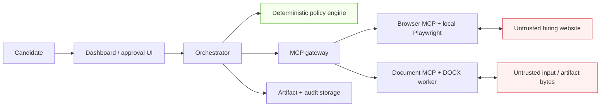

# Resume Agent Threat Model

**Status:** Phase 0 design baseline. This document distinguishes controls already enforced by contracts and tests from runtime controls that must exist before real candidate data or a real browser runner is used.

Resume Agent is a human-supervised job-application workspace, not an unattended application bot. A safe result is not merely a successful browser action: it is an action that remained within the candidate's approved facts, site scope, and one-time approval boundary.

## Scope and security objectives

This model covers the dashboard/API, orchestrator, deterministic policy engine, Browser MCP/Playwright runner, Document MCP/DOCX worker, artifact storage, and audit trail.

The core objectives are:

1. Never submit an application without a fresh approval bound to the exact application, action, and review snapshot.
2. Never fabricate or automatically use unsupported candidate claims.
3. Never expose passwords, cookies, MFA values, provider keys, or raw private data to the model, ordinary logs, or Git.
4. Never bypass CAPTCHA, MFA, rate limits, site access controls, or other anti-abuse mechanisms.
5. Treat websites, documents, MCP responses, model output, and artifact metadata as untrusted until validated at their receiving boundary.
6. Preserve enough redacted evidence to investigate an action or recover safely without retaining unnecessary personal data.

Out of scope for the current local MVP are broad production authentication, multi-tenant authorization, hosted browser streaming, and a claim of compatibility with every hiring site. Those are release gates for later phases, not implied protections.

## Trust boundaries



The model can propose a structured plan, but it does not cross a trust boundary directly. The policy engine classifies every intended action; typed MCP validators then validate the exact input, authorization, page snapshot, artifact identity, and output evidence. The browser runner is local-first so browser credentials stay in the user's local session.

## Protected assets and handling rules

| Asset | Allowed boundary | Never allowed |
|---|---|---|
| Passwords, cookies, MFA values, provider keys | Local credential/session owner only | Model context, prompts, normal logs, screenshots, Git, or ordinary artifacts |
| Candidate facts and reusable answers | Profile/fact service and the minimum task-specific policy or execution input | Unsupported generation, third-party upload requests, or unredacted audit text |
| Resume and cover-letter bytes | Immutable, hash-verified artifact records | Arbitrary local paths, URLs, or unverified byte substitution |
| Approval | Exact application/run/action/review-snapshot scope, one use, short-lived | Reuse across a changed page, application, action, or submission attempt |
| Screenshots, traces, receipts | Redacted artifact store with retention and deletion controls | Public source control or unauthenticated diagnostics |

## Security invariants

These are non-negotiable implementation rules.

1. Browser and document MCPs expose closed, typed tool surfaces; they do not expose arbitrary JavaScript, shell access, local file paths, arbitrary OOXML, or free-form network targets.
2. Browser writes must bind to a fresh page snapshot, origin allowlist, checkpoint revision, uniquely resolved locator, action fingerprint, and verified postcondition.
3. Cross-origin movement, login, MFA, CAPTCHA, unfamiliar widgets, sensitive fields, and legal/signature contexts stop automation for user takeover.
4. Only high-confidence (`>= 0.90`), sourced, verified normal/PII facts are eligible for automatic field filling. The policy never receives the candidate's raw answer value.
5. Uploads require an immutable approved artifact and confirmation. Final submit is always a `final_submission` confirmation; Browser MCP and the application state machine separately require an exact consumed one-shot approval.
6. Resume content and document output must trace to verified facts, approved changes, immutable presentation plans, and matching artifact hashes.
7. The dashboard and runner must redact before persistence. Redaction is a runtime requirement, not a promise made by a schema.
8. Any uncertainty in authorization, snapshot freshness, evidence, artifact identity, or outcome fails closed and asks for recovery or manual reconciliation.

## Threat matrix

| Threat | Abuse path | Mitigation | Current status | Verification |
|---|---|---|---|---|
| Web prompt injection | Page text asks the agent to reveal secrets, ignore policy, or upload unrelated files | Normalize only typed form metadata; treat untrusted page instructions as prohibited; never grant arbitrary script/shell access | Implemented in policy/contract boundary | `packages/policy/test/evaluate.test.ts`; `packages/contracts/test/browser-mcp.test.ts` |
| Malicious MCP response or schema drift | A worker returns extra fields, forged success, or output for a different request | Strict schemas, trusted-context reload, action/snapshot/artifact bindings, and verified evidence | Implemented for contract boundary | Browser tests: semantic validation, trusted claim, verified write result; document tests: strict wire output and trusted context |
| Cross-origin data exfiltration | Redirect or form action moves to an unapproved host | Origin-only allowlist; missing, unapproved, or changed origin routes to takeover; browser validator rejects cross-origin navigation | Implemented in policy/contract boundary | Browser test “blocks cross-origin navigation”; policy test “stops at … cross-origin actions” |
| Credential or secret disclosure | Model, logs, screenshot, trace, or Git captures a password/cookie/MFA value | Secrets remain local to the credential owner; secret fields trigger takeover; `.env` is ignored; runtime redaction and secret scanning are mandatory before real runs | Partial: takeover/ignore rules exist; runtime redaction is a release blocker | Add runner integration tests for log, trace, and screenshot redaction before P1 real-data use |
| CAPTCHA/MFA/security bypass | Agent retries around anti-bot checks or requests bypass instructions | CAPTCHA/MFA route to takeover; security-bypass signals are prohibited; no bypass tools exist | Implemented at policy boundary | `packages/policy/test/evaluate.test.ts` |
| Unsupported resume claim | Model adds experience or metrics not supported by facts | Fact bindings, verified status, change review, document lineage, and content approval gates | Implemented in contracts | Contract tests reject unsupported resume changes, stale facts, and unapproved changes |
| Sensitive, legal, or protected answer automation | Agent chooses EEO, work authorization, compensation, attestation, signature, or background-check answers | Explicit field tags and sensitivity route to user takeover; never automatic | Implemented in policy boundary | Policy test “requires takeover for secret, sensitive, protected, and legal fields” |
| Approval replay or submit bypass | An old approval is replayed after page/answer change or used for another action | Exact application/run/action/review-snapshot binding; expiry, consumption, dispatch claim, and reconciliation gates | Implemented in domain/Browser contracts | Domain tests for stale/wrong/expired approvals and exact consumed browser action |
| Stale page or locator TOCTOU | DOM changes after planning and before a write | Page fingerprint, generation, checkpoint, unique locator/actionability, postconditions, and fresh snapshots | Implemented in Browser MCP contracts | Browser tests reject stale pages, ambiguous targets, and hollow postconditions |
| Malicious or substituted DOCX/artifact | Path traversal, remote URL, byte swap, malicious metadata, or output confusion | No caller paths/URLs/bytes; immutable IDs, server-observed byte hashes, trusted artifact records, package metadata checks, and export lineage | Implemented in Document MCP contracts | Document tests reject paths/URLs, byte mismatch, substitution, forged QA, and invalid export |
| Excessive artifact retention or PII leakage | Unredacted screenshots/traces survive too long or are shared broadly | Minimize and redact by default; encrypted storage, retention configuration, deletion workflow, and access controls are required before persistent real data | Planned runtime control | Add retention/deletion and redaction integration tests before external beta |
| Dependency or local-runner compromise | A compromised dependency, runner, or worker exceeds its intended authority | Lockfile review, dependency updates, least-privilege process permissions, signed/released worker identity, and secret isolation | Planned operational control | Add dependency scanning and runner hardening checks in CI before production |

## Verification baseline

The current executable security suite is intentionally contract-heavy. Run it with:

```text
npm run typecheck
npm test
```

The important checks currently include:

- `packages/policy/test/evaluate.test.ts`: deterministic automatic/confirmation/takeover/prohibited routing, including secret and legal fields, cross-origin movement, injection signals, uploads, and no automatic submit.
- `packages/contracts/test/browser-mcp.test.ts`: rejects arbitrary selectors/JavaScript/local paths, stale pages, cross-origin navigation, forged authorization, and unverified write outcomes.
- `packages/domain/test/application-machine.test.ts`: verifies one-shot, exact-scope approval consumption and safe state transitions around submission.
- `packages/contracts/test/document-mcp.test.ts`: verifies strict DOCX tool inputs, immutable artifact hashes, approved content/presentation lineage, QA evidence, and export identity.

Passing these tests proves the current contracts and pure policy code. It does **not** prove that a future browser runner has redacted every log, that encrypted storage is configured, or that a real hiring site behaves safely. Those require integration and end-to-end tests on the local fixture app before real-world use.

## Required controls before the first real browser run

1. Wire every Browser MCP call through `@resume-agent/policy`; reject an absent or non-automatic policy decision rather than treating it as a default allow.
2. Keep Playwright auth state, browser profiles, cookies, and passwords local; exclude them from artifacts, traces, source control, and model prompts.
3. Implement redaction at log, screenshot, trace, error-report, and audit-write boundaries; test that direct secrets and common PII forms never persist unredacted.
4. Enforce durable approval issuance, expiry, consumption, and manual-reconciliation storage with a real database transaction boundary.
5. Encrypt artifacts at rest, implement per-run deletion and retention configuration, and test artifact access authorization.
6. Run destructive automation only against the controlled fixture-form app until the corresponding compatibility and safety tests pass.

## Incident response and recovery

If a policy or MCP validator detects an unsafe condition, the runner must stop new writes, persist a redacted checkpoint with the reason code, and request takeover or manual reconciliation. If a consequential action has an uncertain outcome, it must never be retried automatically; record the evidence available and ask the user to verify the application status. A suspected secret or PII leak requires revoking affected credentials where applicable, restricting artifact access, preserving only the minimum incident evidence, and deleting the leaked artifact under the retention policy.
